# SauScript 文档

本文档面向 SauScript v1.2.4 

## 程序

SauScript 是一种脚本语言，经编译成语法树之后即可执行。

SauScript 编译文件时，第一行代码即为程序的入口。最后一行代码即为程序的出口。

SauScript 也提供了 REPL 程序可以即时求值。

## A + B 问题

下面这个程序将会从控制台输入两个整数，并输出他们的和

```
a := 0
b := 0
input a
input b
sum := a + b
print sum
```

在这段程序中 `:=` 运算符用于创建并初始化变量，变量的类型根据初始化的值推导。在相同的作用域下，同名变量只能被定义一次。本语言共四种类型，分别是 `void int real func` 空、整型、实数型、函数。在参与运算的时候，整型可能会根据情况提升为实数型，其它任何隐式转换都是不允许的。你可以显式调用 `int()` 函数取整。还有其它更多取整和转换函数参见附录。

在 SauScript 中，万物皆为表达式。赋值运算符返回的是改对象的左值。因此上面的代码可以简写为：

```
input a := 0
input b := 0
print a + b
```

运算符的优先级和结合性详见附录。

## 计算 e

下面这个程序会计算自然对数的底数 e：

```
# e = 1 + 1/1 + 1/2 + 1/6 + .. + 1/n!
e := 1.0
p := 1.0
for i := 1; i < 100; ++i {
    p *= i
    e += 1.0 / p
}
print e
```

`#` 后面直到换行符的内容均为注释。

你也可以选择不进行计算，直接输出预定义的数学常数或使用预定义的数学函数

```
print e
print exp(1)
```

既然全局已经预定义了 e，那么第一段程序为什么可以重新定义 e 呢？因为全局作用域是默认作用域的父作用域，默认作用域重新定义的 e 遮挡（shadow）了全局的 e。

## 素数判断

下面这个程序会判断输入数字以下的整数是否为素数。素数则输出本身，非素数则输出相反数。

```
isPrime := function(t: int): int = {
    if t < 2 {
        return false
    }
    for i := 2; i * i <= t; ++i {
        if t % i == 0 {
            return false
        }
    }
    return true
}

input m := 0
for i := 1; i < m; ++i {
    print if isPrime(i) {
        i
    } else {
        -i
    }
}
```

程序开头定义了一个判断素数的函数。函数字面量由`function`关键字引导，变量的名字、变量的类型、返回值的类型必须写出。

`t` 是函数的局部变量，只有在函数内部可以访问，但函数内部却可以无条件的使用外部的变量，这是有可能引起问题的。

你可能以及注意到 if 表达式的使用，你如果不喜欢这个风格也可以用三目运算符。

在 SauScript 里面，万物皆为表达式，不仅仅是 if-else，其它所有流程控制都是表达式。语句块的最后一个表达式的返回值即为这个语句块的返回值。

流程控制的具体使用方法详见附录。

### 语法树

SauScript 附带了语法树生成功能。素数判断的代码的语法树如下所示：



# 附录

## 运算符和字面量

SauScript 的运算符和字面量优先级从低到高：

| 优先级 | 运算符                                                       | 结合性   |
| ------ | ------------------------------------------------------------ | -------- |
| 0      | `print input`<br>`throw yield return`<br>`:= = += -= *= /= %= >>= <<= &= ^= |=`<br>`?:` |从右到左 |
| 1      | `||`                                                         | 从左到右 |
| 2      | `&&`                                                         | 从左到右 |
| 3      | `|`                                                          | 从左到右 |
| 4      | `^`                                                          | 从左到右 |
| 5      | `&`                                                          | 从左到右 |
| 6      | `== !=`                                                      | 从左到右 |
| 7      | `< > <= >=`                                                  | 从左到右 |
| 8      | `<< >>`                                                      | 从左到右 |
| 9      | `+ -`                                                        | 从左到右 |
| 10     | `* / %`                                                      | 从左到右 |
| 11     | `! ~`<br>`+ - ++ --`（前缀）                                 | 从右到左 |
| 12     | `++ --`（后缀）<br>`()`（函数调用）                          | 从左到右 |
| 13 | `true false __LINE__ nan inf function`<br>`continue break`<br>`if-else try-catch`<br>`while do-while for` | 从左到右 |

## 流程控制

### 代码块

代码块可以创造一个内嵌的作用域，代码块的最后一句话即为它的返回值。

```
b := 1 + {
	a := 2
	a + 3
} # a is no longer accessible here
print b # 6
```

空的代码块返回 void。例如在需要返回 void 的函数可以这样写。

```
return {}
```

### If-Else

if-else 表达式如下所示

```
input a := 0
b := if a > 0 {
	1
} else {
	-1
}
```

如果 a 是正数，则 b 为 1，否则为 -1。

如果省略 `else` 则会自动补充为 `else {}`

需要注意花括号是不可以省略的，但是 `else` 后紧跟 `if` 除外（构成 `else if`）

### Try-Catch

try-catch 表达式如下所示

```
print try {
	throw 2
} catch e {
	e + 3
}
```

输出 5

### While

while 表达式如下所示

- 例一

```
i := 0
while i < 10 {
	print i
	++i
}
```

输出 0 ~ 9

- 例二

```
i := 1
print while true {
	if i > 3 {
		yield 233
	}
	print i++
}
```

输出 1 2 3 233

### Do-While

do-while 表达式如下所示

```
do {
	print 233
} while false;
```

输出 233

### For

for 表达式如下所示

```
for i := 0; i < 10; ++i {
	print i
} # i is no longer accessible here
```

输出 0 ~ 9

### 跳转

- continue 结束本次循环。
- break 结束本层循环，返回 void，等价于 yield {}。
- yield _expression_ 结束本层循环，并返回表达式的值。
- return _expression_ 结束函数，并返回表达式的值。
- throw _expression_ 抛出异常。

